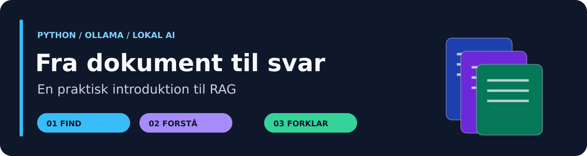
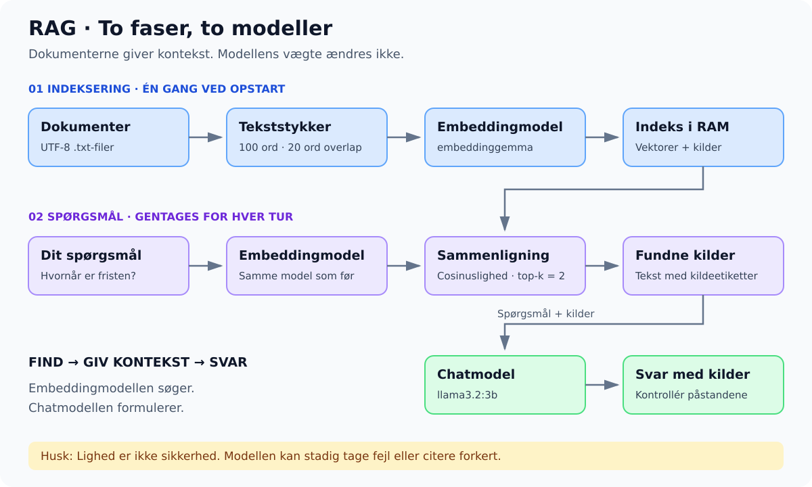

<p align="center"></p>

# 📚 RAG · Fra dokument til svar

**Byg en lokal dokumentassistent med Python og Ollama.** En undervisningspakke til studerende, der allerede kender funktioner, lister, dictionaries og løkker.

🟦 **Python 3.11+** · 🟩 **Lokale modeller** · 🟪 **4 × 90 minutter** · 🟧 **Ingen betalt API-nøgle**

> [!IMPORTANT]
> Alle dokumenter i `data/` indeholder **fiktive undervisningsdata**. De beskriver ikke officielle Zealand-regler. AI-svar skal kontrolleres mod de viste kilder.

## 🧭 Vælg din vej

| Jeg vil … | Åbn |
| :--- | :--- |
| 🚀 Installere og køre programmet | [Opsætning trin for trin](docs/setup.md) |
| 🧠 Forstå RAG og Python-koden | [Teori, diagrammer og kodegennemgang](docs/rag-explained.md) |
| 📝 Løse de to studenteropgaver | [Opgavesæt og rapportskabelon](opgaver/README.md) |
| 🎓 Undervise eller løse øvelser | [Undervisningsplan og mini-projekt](docs/teaching.md) |
| 🛠️ Løse en fejl | [Fejlfinding](docs/troubleshooting.md) |
| 🇬🇧 Read the original English guide | [English teaching guide](docs/teaching-guide-en.md) |
| ✅ Se rettelser og testgrænser | [Validering og ændringer](docs/validation.md) |

## 💡 Hvad bygger vi?

Forestil dig en **åben-bog-eksamen**: find først de relevante afsnit, og skriv derefter svaret med henvisning til dem. RAG betyder *Retrieval-Augmented Generation*.



Programmet læser `.txt`-filer, deler dem i tekststykker, sammenligner deres embeddings med spørgsmålet og sender de to bedste kandidater til en chatmodel. Dokumenterne træner **ikke** modellen; de tilføjes som kontekst til det enkelte spørgsmål.

## 🚀 Hurtig start · Windows

Installér [Python](https://www.python.org/downloads/) og [Ollama](https://ollama.com/download). Download repoet via **Code → Download ZIP**, pak det ud, og åbn mappen i VS Code. Åbn derefter en terminal i mappen med `rag_demo.py`.

```powershell
py -m venv .venv
.venv\Scripts\python.exe -m pip install -r requirements.txt
ollama pull embeddinggemma
ollama pull llama3.2:3b
.venv\Scripts\python.exe rag_demo.py
```

Ollama skal køre. Brug eventuelt `ollama serve` i en anden terminal. Se [macOS/Linux og uv](docs/setup.md) for alternative kommandoer.

> [!TIP]
> Download modellerne **før undervisningen**. Når pakker og de to lokale modeller er installeret, kræver demoen ingen ekstern AI-tjeneste. Hastigheden afhænger af computerens hukommelse og hardware.

## 🔎 Prøv disse spørgsmål

| Spørgsmål | Forventet fakta eller adfærd | Kilde |
| :--- | :--- | :--- |
| `When must I submit the final report?` | 12 December 2026 at 12:00 | `course.txt` |
| `When does the robotics lab close?` | 16:00 Monday to Friday | `lab.txt` |
| `How much does the demonstration contribute to the assessment?` | 40 percent | `assessment.txt` |
| `What is the Wi-Fi password?` | Oplysningen findes ikke i dokumenterne | Ingen |

Dette er **forventninger**, ikke optagede modelresultater. Se først `RETRIEVED EVIDENCE`, og kontrollér derefter svaret. Skriv `exit` eller `quit` for at stoppe.

## 🗂️ Pakkens indhold

| Fil/mappe | Formål |
| :--- | :--- |
| [rag_demo.py](rag_demo.py) | Kort Python-program med danske kommentarer |
| [data/](data/) | Tre fiktive kildedokumenter |
| [evaluation_questions.json](evaluation_questions.json) | Syv spørgsmål med svar og tre uden svar |
| [tests/test_rag_demo.py](tests/test_rag_demo.py) | Automatiske tests uden modeldownloads |
| [docs/](docs/) | Teori, undervisning, opsætning og illustrationer |
| [requirements.txt](requirements.txt) | Python-afhængigheder |

## ✅ Test programlogikken

```powershell
.venv\Scripts\python.exe -m unittest discover -s tests -v
```

Testene bruger simulerede modelsvar. De tester programlogik og fejlhåndtering, **ikke** modellernes faktuelle kvalitet. Brug [evalueringsøvelsen](docs/teaching.md#evaluering) med rigtige modeller før undervisningen.

> [!WARNING]
> Lighedsscore er ikke sikkerhed for et korrekt svar. Top-k finder også kandidater til irrelevante spørgsmål. Kildehenvisninger og afvisninger fra modellen er ikke automatisk verificerede.

## 📖 Officielle referencer

- [Ollama: embeddings](https://docs.ollama.com/capabilities/embeddings)
- [Ollama Python-bibliotek](https://github.com/ollama/ollama-python)
- [EmbeddingGemma](https://ollama.com/library/embeddinggemma) · [Llama 3.2](https://ollama.com/library/llama3.2)

Se [LICENSE](LICENSE) for repositoryets licens. Modellicenser gælder separat.
