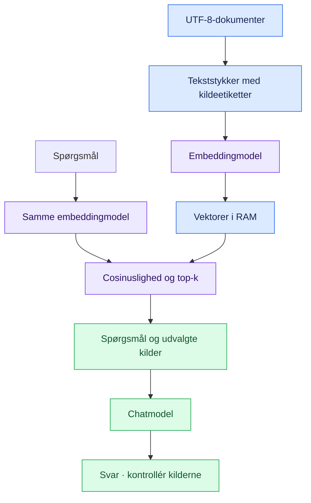
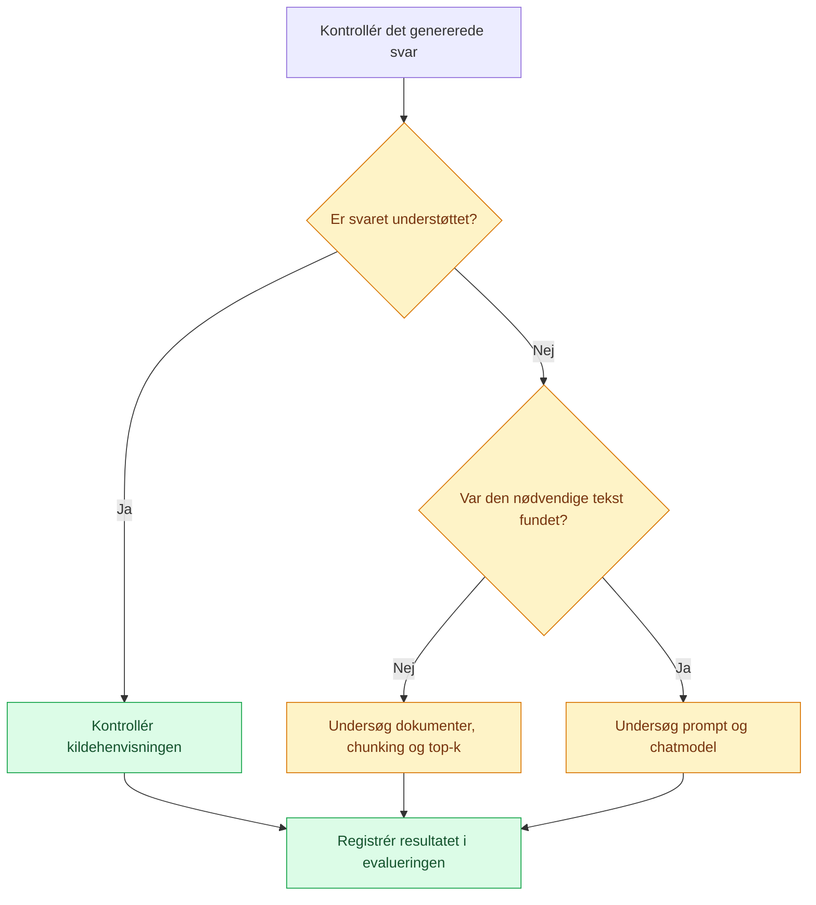

# 🧠 RAG forklaret · Fra tekst til dokumenteret svar

[← Tilbage til forsiden](../README.md)

## De to faser


**Indeksering** sker én gang ved opstart: læs filer, del teksten, beregn embeddings og gem dem i RAM. **Spørgsmålsbehandling** gentages: embed spørgsmålet, find relevante tekststykker, og giv dem til chatmodellen.



## Begreber med konkrete eksempler

| Begreb | Forklaring | I denne pakke |
| :--- | :--- | :--- |
| Dokument | Den oprindelige kilde | `course.txt` |
| Chunk | Et mindre tekststykke | Op til 100 ord |
| Overlap | Ord gentaget i nabostykker | 20 ord |
| Embedding | En numerisk repræsentation af tekst | En liste med tal |
| Retrieval | Søgning efter relevante tekststykker | Rangering med cosinuslighed |
| Top-k | Hvor mange kandidater vi vælger | Som standard 2 |
| Context | Kilder sendt sammen med spørgsmålet | Tekst med kildeetiketter |
| Generation | Modellens formulering af svaret | `CLIENT.chat(...)` |

RAG ændrer ikke modellens vægte. Programmet har en fast rækkefølge i Python og er derfor ikke i sig selv en autonom agent.

## Chunking og overlap

Med `size=6` og `overlap=2` bliver ordene:

```text
Input:   A B C D E F G H I J
Chunk 1: A B C D E F
Chunk 2:         E F G H I J
```

Trinlængden er `size - overlap`, her 4. Overlap kan bevare kontekst ved en grænse, men giver også gentagelser. Ord er ikke det samme som modeltokens. De tre medfølgende filer er så korte, at hver fil normalt giver ét tekststykke.

## Koden trin for trin

| Funktion | Input → output | Hvad studerende skal forstå |
| :--- | :--- | :--- |
| `chunk_text` | Tekst → liste af tekststykker | `split`, udsnit, `range` og `break` |
| `load_chunks` | Mappe → records | `Path`, UTF-8, `enumerate` og dictionaries |
| `validate_vectors` | Vektorer + forventet antal → kontrol | Hvorfor data skal passe sammen |
| `embed` | Liste af tekster → liste af vektorer | Et API-kald til den lokale Ollama-server |
| `cosine` | To vektorer → lighedsscore | Prikprodukt og vektorers længde |
| `retrieve` | Spørgsmål + indeks → rangerede kilder | `zip`, sortering og `top_k` |
| `answer` | Spørgsmål + kilder → svartekst | Roller, prompt og kontekst |
| `main` | Tastaturinput → terminaloutput | Indeksering før spørgeløkken |
| `run` | Programkørsel → statuskode | Fejlhåndtering og normal afslutning |

### 1 · Bevar forbindelsen til kilden

```python
{"source": "course.txt#chunk1", "text": "The final report ..."}
```

`source` gør det muligt at finde tilbage til filen. Chunknummeret gælder den aktuelle opdeling og kan ændre sig, når teksten eller chunkstørrelsen ændres.

### 2 · Sammenlign vektorer

Cosinuslighed er prikproduktet divideret med produktet af vektorernes længder. Parallelle vektorer giver 1, vinkelrette giver 0, og modsatrettede giver -1. Det fortæller om geometrisk lighed, ikke om svarets sandhed.

`zip(records, vectors)` forbinder hvert tekststykke med dets vektor. Programmet kontrollerer først, at antallene passer. Ellers ville `zip` stoppe ved den korteste liste og skjule en fejl.

### 3 · Byg prompten

Systembeskeden beder modellen om at bruge kilderne, citere etiketterne og indrømme manglende oplysninger. Brugerbeskeden indeholder spørgsmålet og de fundne tekststykker. `temperature=0` mindsker tilfældighed, men garanterer ikke korrekthed.

> [!WARNING]
> Tekst i dokumenter er data, også hvis den ligner en instruktion. Prompten beder modellen ignorere sådanne instruktioner, men dette er ikke en sikkerhedsgrænse. Modellen kan stadig opfinde svar eller citere en kilde forkert.

## Hvor opstår en fejl?



Der findes ingen universel scoregrænse, som sikkert adskiller relevante og irrelevante tekststykker. Afprøv ændringer på det samme evalueringssæt.
