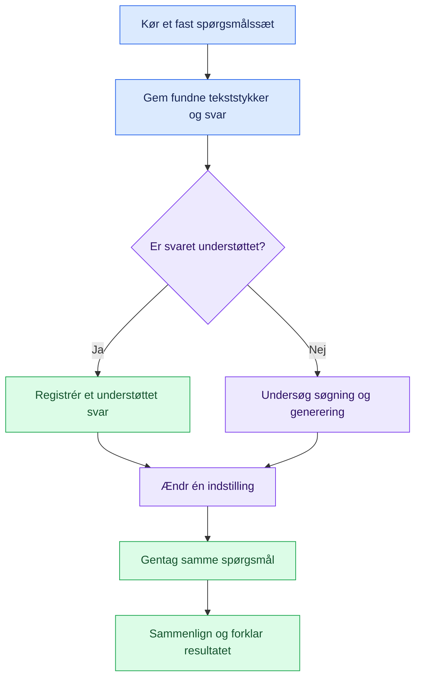

# 🎓 Opgavesæt · Byg og undersøg en lokal RAG-assistent

[← Projektets forside](../README.md) · [Opsætning](../docs/setup.md) · [Teori og diagrammer](../docs/rag-explained.md)

**Fagligt niveau:** grundlæggende Python, funktioner, lister, dictionaries og filhåndtering. Arbejd individuelt eller i grupper på 2–3. Alle skal kunne forklare kode og resultater.

I arbejder med en **fiktiv kursus- og laboratorieassistent**. Assistenten skal finde oplysninger i lokale tekstfiler og formulere svar med kilder. I skal undersøge, hvornår den lykkes, og hvornår den fejler.

| Opgave | Fokus | Vejledende tid | Produkt |
| :--- | :--- | :--- | :--- |
| 🟦 [1 · Forstå og afprøv RAG](opgave-1.md) | Kør demoen, forstå koden og undersøg søgning | 2 × 90 minutter efter installation | Forsøgsnoter og forklaringer |
| 🟪 [2 · Byg din egen dokumentassistent](opgave-2.md) | Egne dokumenter, evaluering og én kontrolleret ændring | 2 × 90 minutter + 2–3 timers hjemmearbejde | Kode, dokumenter, testresultater og rapport |
| 📝 [Rapportskabelon](rapportskabelon.md) | Registrér jeres arbejde undervejs | Bruges i begge opgaver | Udfyldt rapport med faktisk evidens |

> [!IMPORTANT]
> Installér pakker og download modeller inden timen. Følg [opsætningsguiden](../docs/setup.md). Alle medfølgende kursusoplysninger er fiktive. Opgavesættet fastsætter ingen officiel afleveringsfrist; den meddeles af underviseren.

## Læringsmål

Efter forløbet kan I:

- Forklare forskellen mellem retrieval, embeddings, kontekst og generering.
- Følge et spørgsmål gennem funktionerne i `rag_demo.py`.
- Tilføje dokumenter og kontrollere, om de nødvendige tekststykker bliver fundet.
- Undersøge chunkstørrelse og `top_k` med et fast spørgsmålssæt.
- Skelne mellem manglende evidens og et forkert genereret svar.
- Dokumentere både gode resultater og begrænsninger ved RAG.

## Fra observation til forbedring

## Arbejdsregler

1. Arbejd i jeres egen kopi eller Git-gren. Tag en kopi af rapportskabelonen til jeres aflevering.
2. Gem hver forsøgsindstilling, inden I ændrer noget igen.
3. Genstart demoen efter ændringer i kode eller dokumenter.
4. Gem faktiske modelsvar; forventede svar er ikke forsøgsresultater.
5. Brug fiktive eller godkendte dokumenter uden personfølsomme oplysninger.
6. I må bruge AI til hjælp, men skal forklare forslagene, kontrollere dem og beskrive brugen i rapporten.

**Til underviseren:** Opgave 1 passer til session 1–2 i [undervisningsplanen](../docs/teaching.md), og opgave 2 til session 3–4 med hjemmearbejde. Bedømmelseskriterierne i opgave 2 er et forslag til dette opgavesæt, ikke en officiel eksamensordning.
